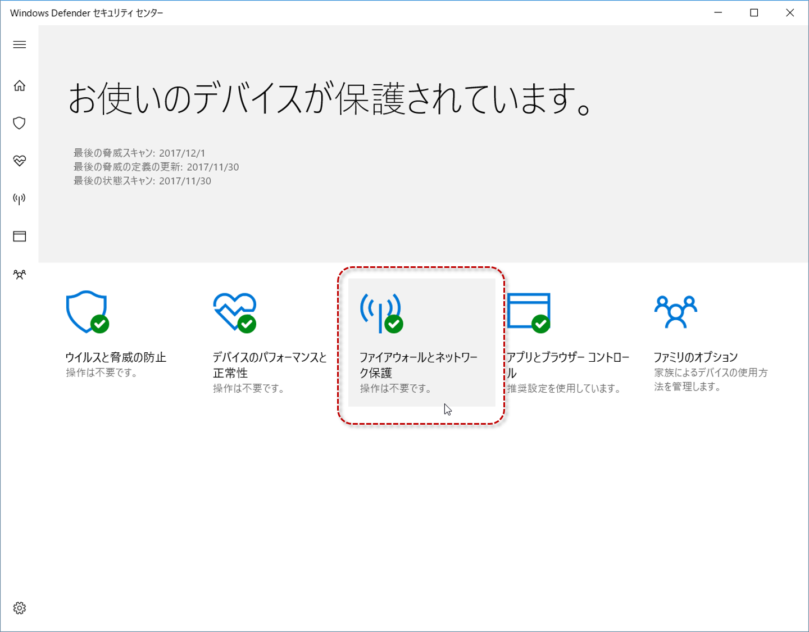

Windows 10 / Windwos Defender利用時に必要なFirewallの設定変更
=============================================================

これは、CNDJP第1回勉強会のハンズオン（前半分）のチュートリアルで、Windows 10 / Windwos Defender利用の際に必要なFirewallの設定変更の手順を記したものです。 

ハンズオン・チュートリアルを実施中でなければ、[そちらの手順](./handson1.md)から始めてください。

設定変更の手順
--------------

Windowsのタスクバーから、Windows Defenderのアイコンをダブルクリックします。

［Windows Devender セキュリティ センター］ウィンドウで、［ファイアウォールとネットワーク保護］をクリックします。

［ファイアウォールによるアプリケーションの許可］をクリックします。

［許可されたアプリ］ウィンドウで、［設定の変更］ボタンをクリックして、設定変更の権限を取得します。

VagrantWinNFSdのプライベートネットワークのチェックを外し（プライベートネットワーク経由での通信を許可）、[OK]をクリックします。

以上。
